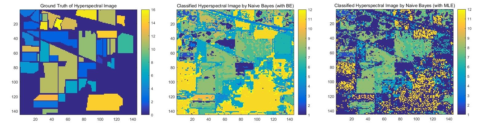

# NaiveBayesClassification
A MATLAB implementation of Naive Bayes for classification problem. 

## Introduction
Naive Bayes is one of the most basic machine learning algorithm, and it has been widely used in many comercial applications. Most of existing machine learning toolkits such as scikit-learn, OpenCV/ml, Weka have provided excellent API for Naive Bayes. This MATLAB implementation aims to fulfill Naive Bayes algorithm as introduced by the Chinese book The Method of Statistical Learning written by Hang Li. The code provides a convenient API and supports for both Maximum Likelihood Estimation based Naive Bayes and Bayesian Estimation based Naive Bayes. An application usage on problem of hyperspectral image classification is presented in the demo code. Here are the results of the demo with two different implemetations.

## Usage
To run the demo provided by the code, directly run the MATLAB script run_classification.m. If you want to use your won data, please prepare your data with the format required by the function Naive_Bayes.m.

